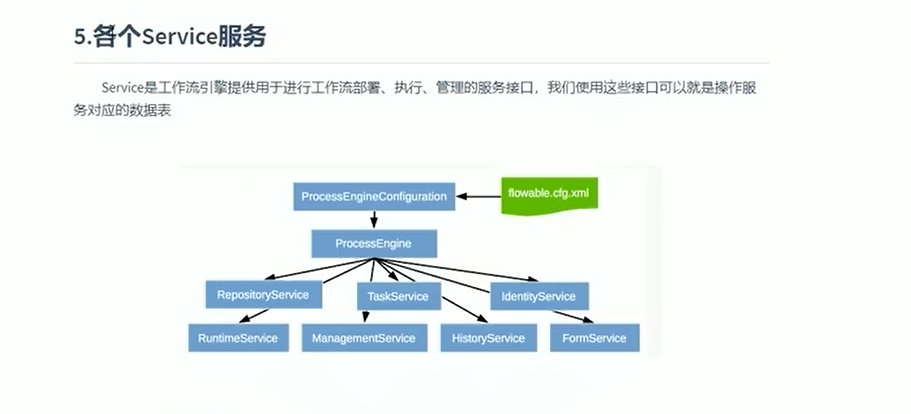
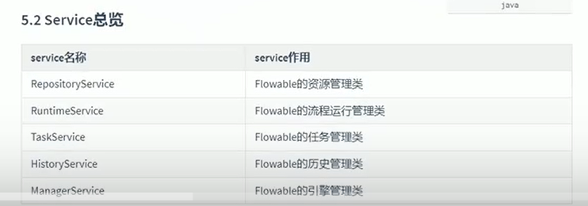
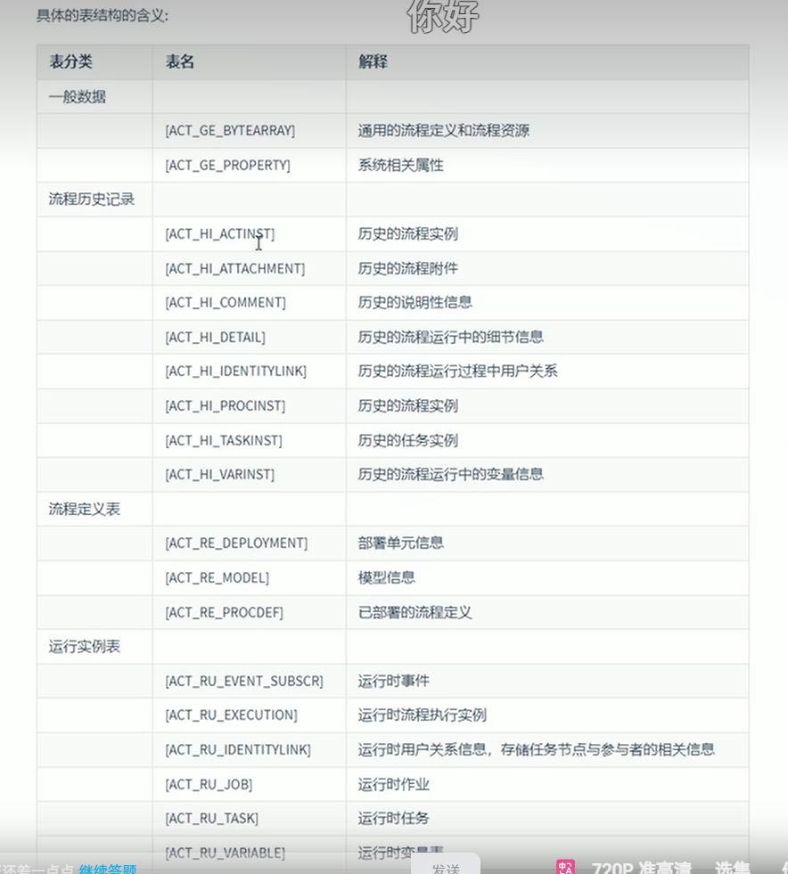

1.学习flowable提供哪些接口

 
1.1部署用：  
@Autowired  
private RepositoryService repositoryService;  
1.2启动用：  
@Autowired  
private RuntimeService runtimeService;  
1.3任务用：  
@Autowired  
private TaskService taskService;

2.表结构的支持

3.流程实例的启动涉及的表

