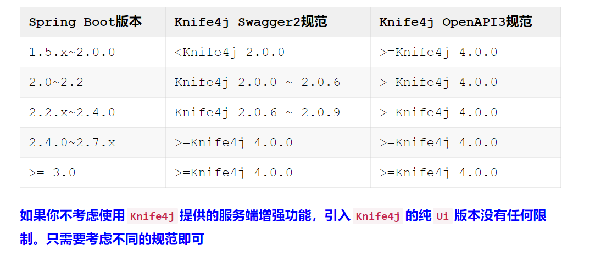
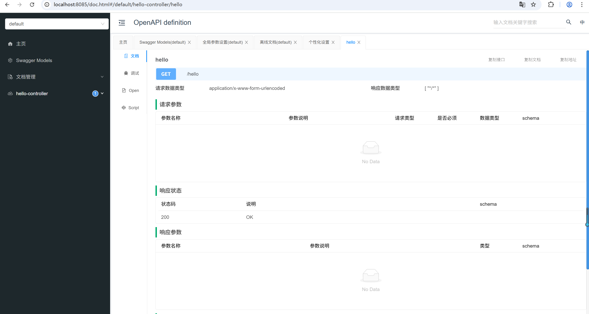
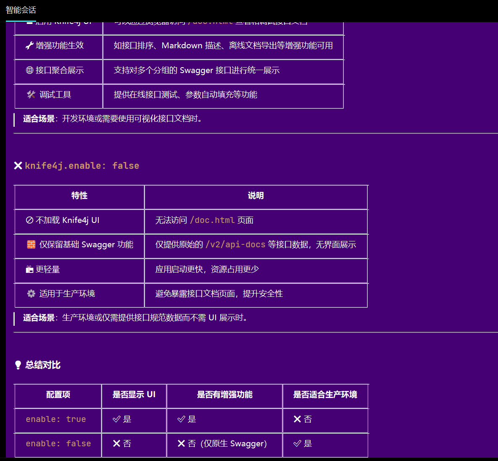
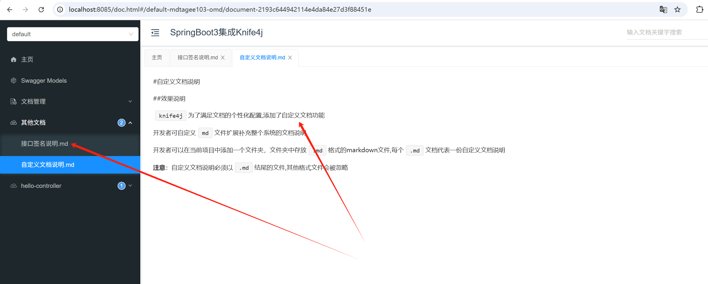
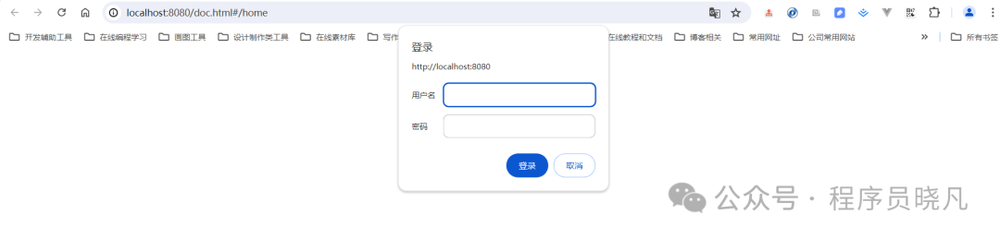
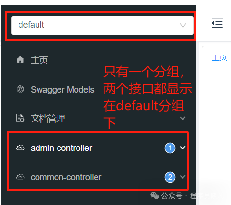
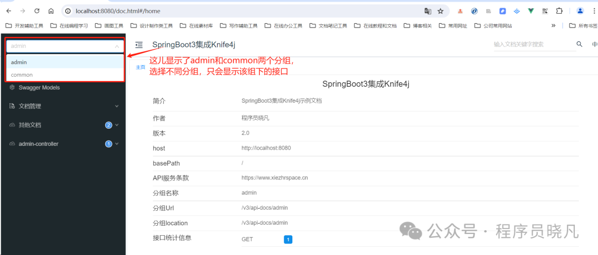

## 1.Knife4j 是什么？
Knife4j 是一个为 Java 项目生成和管理 API 文档的工具。实际上，它是 Swagger UI的一个增强工具集，
旨在让 Swagger 生成的 API在线文档更加优雅、美观、强大。
① 官方地址http://knife4j.net/
②文档地址https://doc.xiaominfo.com/docs/quick-start

## 2.为什么要使用Knife4j
使用Knife4j主要有以下优点，就问哪个不吸引我们呢？
**美观的UI**：
相比于原生 Swagger UI，Knife4j 提供了更加人性化和美观的界面设计丰富的文档交互功能：
支持在线调试、请求参数动态输入、接口排序等个性化配置：可自定义 API 文档的界面风格，实现文档界面的个性化展示

## 3.Spring Boot版本兼容性

## 4.环境
我们这选用的环境如下  
jdk17;  
SpringBoot3.3.1;  
knife4j 4.4.0;  
OpenAPI3协议规范;  

注意：  
我们这里使用的是SpringBoot3Spring Boot 3  
只支持OpenAPI3规范Knife4j提供的starter已经引用springdoc-openapi的jar，  
需注意避免jar包冲突JDK版本必须 >= 17  

## 5.访问Knife4j在线文档
浏览器输入：http://localhost:8080/doc.html

## 6.knife4j:
    enable: false ##true和false的区别

## 7.配置自定义文档
knife4j:  
    documents:  
        - group: default  
        name: 其他文档  
        locations: classpath:markdown/*  
解释说明：  
group: 分组的名称，这儿我们还没有配置分组，所以默认的是default  
name: 界面呈现时菜单显示  
locations: markdown文档路径  

## 8.访问权限配置： 
为了保证生产环境下接口服务安全，我们可以提供一个登陆界面的功能,只有输入用户名和密码才能访问
knife4j:  
    basic:  
        enable: true  
        username: admin  
        password: 123456  
  

## 9.接口排序
使用Knife4j提供的增强注解@ApiOperationSupport中的order字段可进行接口排序  

① 修改application.yml  
springdoc:  
    swagger-ui:  
       operations-sorter: order  
2.调整@ApiOperationSupport中的order  
@ApiOperationSupport(author="李四",order=1)  

## 10.接口分组
在默认情况（没有分组）的情况下，所有包下接口都显示在一一个默认组下面，如/common/* 和/admin/* 访问路径下的接口都显示在一起，如下图所示
  
解决办法就是添加分组信息，这里有两种配置方法  
springdoc:  
    group-configs:  
    - group: 'admin'  
    paths-to-match: '/admin/**'  
    packages-to-scan: com.hongda.knife4jswaggertool0010.controller  
    - group: 'common'  
    paths-to-match: '/common/**'  
    pa~~ckages-to-scan: com.hongda.knife4jswaggertool0010.controller  

② 通过配置类Knife4jConfig添加两个分组  
@Configuration  
public class SpringDocConfig {}  

以上两种配置时等效的，再访问:http://localhost:8080/doc.html 显示如下

## 11.过滤请求参数
通常我们在开发接口时,比如一个新增接口和一个修改接口,修改接口需要传递主键id、而新增接口则不需要传递此属性,但大部分情况,我们只写一个Model类,此时在新增接口时显示主键id会显得很多余.  
使用自定义增强注解ApiOperationSupport中的ignoreParameters属性,可以强制忽略要显示的参数.  
忽略的规则如下:  
例如新增接口时,某实体类不需要显示Id,即可使用该属性对参数进行忽略.ignoreParameters={"id"}  
如果存在多个层次的参数过滤,则使用名称.属性的方式,例如 ignoreParameters={"uptModel.id","uptModel.uptPo.id"},  
其中uptModel是实体对象参数名称, id为其属性,uptPo为实体类,作为uptModel类的属性名称；   

如果参数层级只是一级的情况下,并且参数是实体类的情况下,不需要设置参数名称,直接给定属性值名称即可  
如果实体类属性中是通过List这种数组的方式,那么过滤规则会有所不同,在属性后面需要追加一个下标[0]，ignoreParameters={"uptModel.uptPo[0].id"} 

表单忽略：  @ApiOperationSupport(ignoreParameters={"id","orderDate.id"})  
