# 1.mybatis-plus的使用步骤  

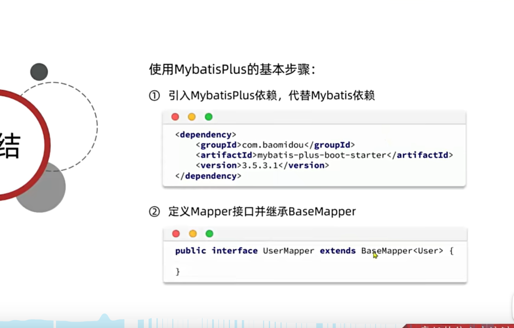

# 2.常用的注解：

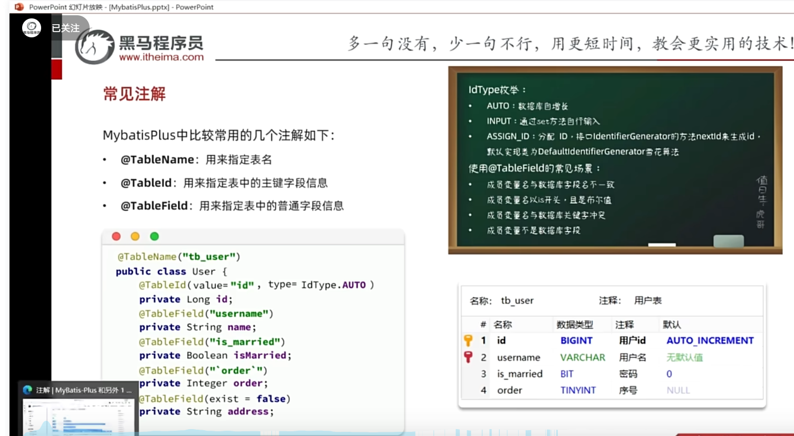  

# 3.id的设置：

## 3.1表中的id字段，不用设置自增；

@TableId(value = "id",type= IdType.ASSIGN_ID)

## 3.2表中的id字段，设置自增；

@TableId(value = "id",type= IdType.AUTO)

# 4.常见的配置

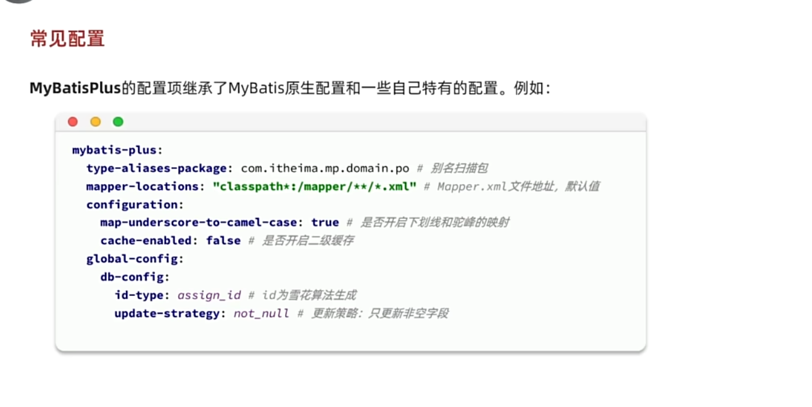  
# 5.条件构造  
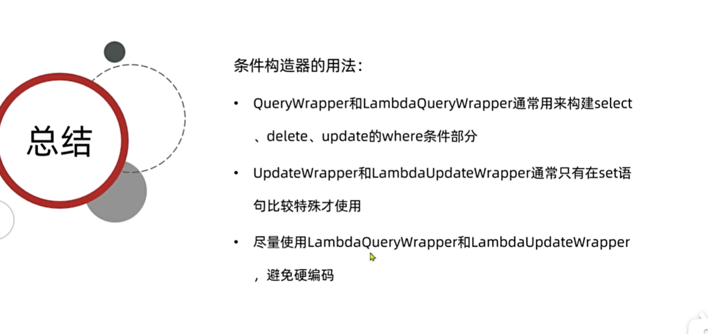

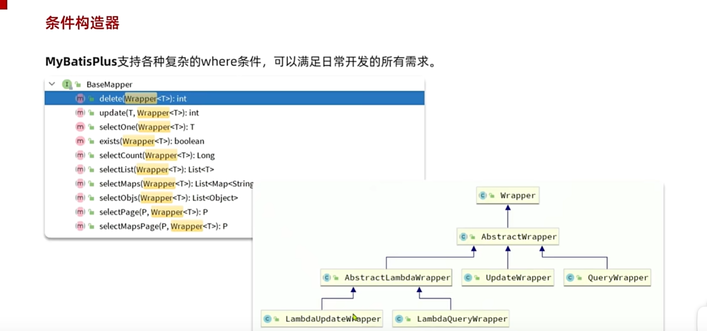

## 5.1 更新
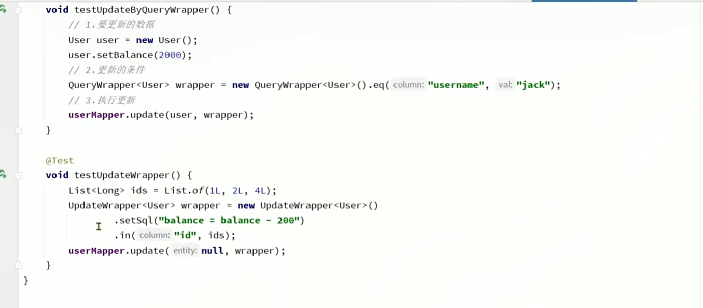
## 5.2 查询
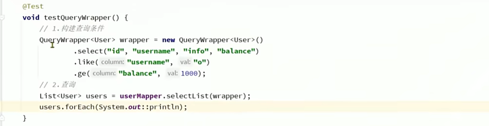  
# 6.mybatis-plus的自定义sql

## 6.1自定义更新sql
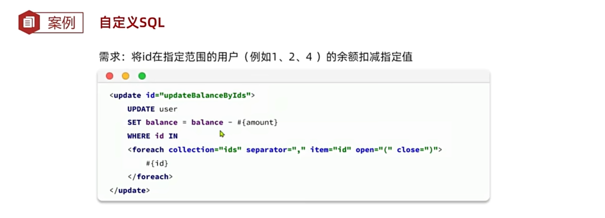
## 6.2 自定义更新sql，代码where条件+xml的sql语句
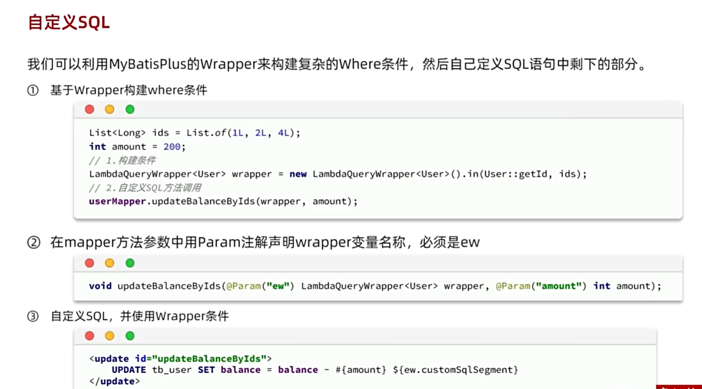

# 7.mybatis-plus的service接口
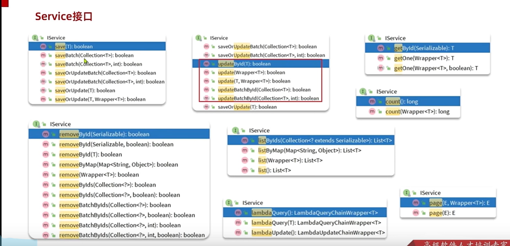
# 8.mybatis-plus的service实现类
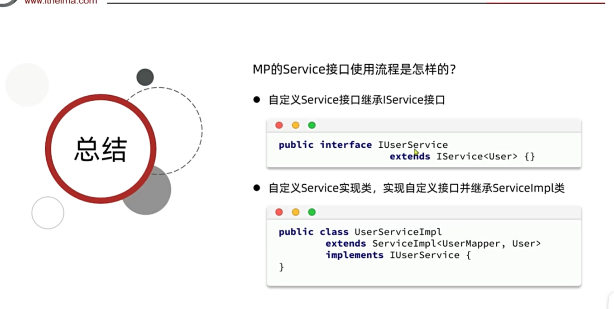  

# 9.mybatis-plus的yml的配置

mybatis-plus:  
    type-aliases-package: com.hongda.entity #实体类包名  
    mapper-locations: classpath*:mapper/**/*.xml #mapper.xml 的文件地址  
    configuration:  
        map-underscore-to-camel-case: true #开启驼峰命名规则  
        cache-enabled: false #关闭二级缓存  
    global-config:  
        db-config:  
            id-type: assign_id #主键策略 雪花算法  
            update-strategy: not_null #修改时，只修改不为空的字段  

# 10.swagger的配置
   ## 10.1 maven依赖：
   <dependency>
   <groupId>com.github.xiaoymin</groupId>
   <artifactId>knife4j-openapi2-spring-boot-starter</artifactId>
   <version>4.5.0</version>
   </dependency>
##  10.2 配置：

 knife4j:  
    enable: true  
    openapi:  
        title: 用户管理接口管理文档  
        description: "用户管理接口管理文档"  
        email: 102458249@qq.com  
        concat: 波哥  
        url: https://github.com/102458249/hongda  
        version: 1.0.0  
        group:  
            default:  
                group-name: default  
                api-rule: package  
                api-rule-resources:  
                - com.hongda.controller  

## 10.3 访问地址：http://localhost:8088/doc.html

# 11.mapper中的sql语句
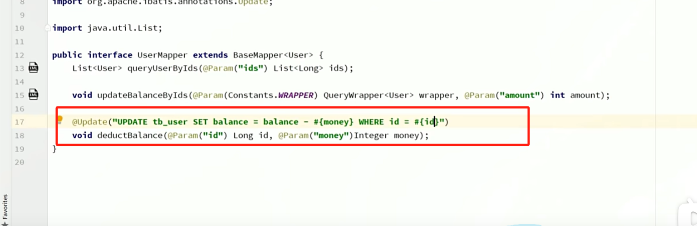

# 12.批量查询：  
mybatis-plus的servive方法：批量保存：saveBatch其实还是一条一条的保存，我们需要开启批量保存。  
在  url: jdbc:mysql://127.0.0.1:3306/hongda?serverTimezone=GMT%2B8&useUnicode=true&useSSL=false&characterEncoding=utf-8  
添加 &rewriteBatchedStatements=true

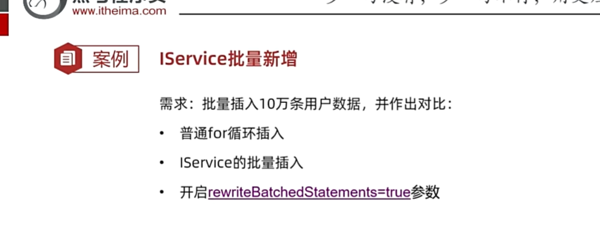

# 13.mybatis-plus的生成代码

 ## 13.1新增插件mybatisplus
 ## 13.2 Other中 Config Database中配置数据库链接
 ## 13.3 Other中 Config Generator配置生成的位置

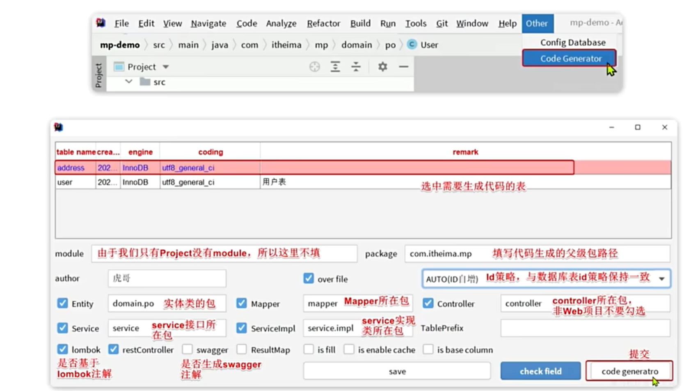

# 14.Db静态工具
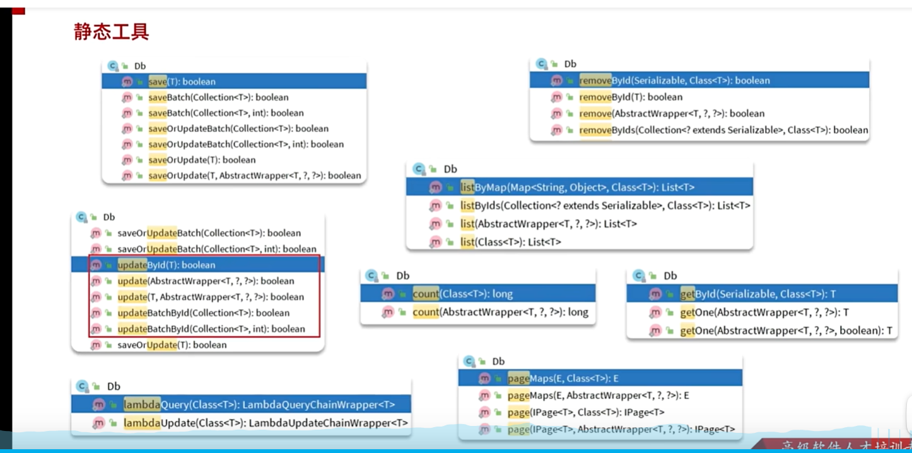

# 15.mybatis-plus的配置逻辑删除  
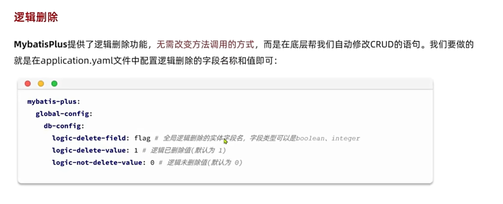

# 16.mybatis-plus的枚举类型转换
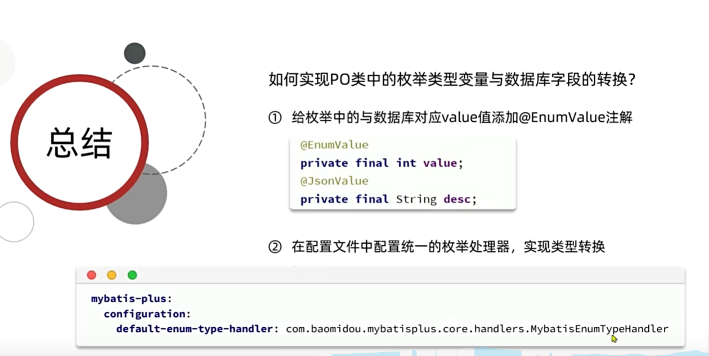  

枚举中@EnumValue 字段数据映射的数据库数据
@JsonValue 加在枚举字段上，指定返回的是名字还是状态给前端。

# 17.mybatis-plus的JSON处理
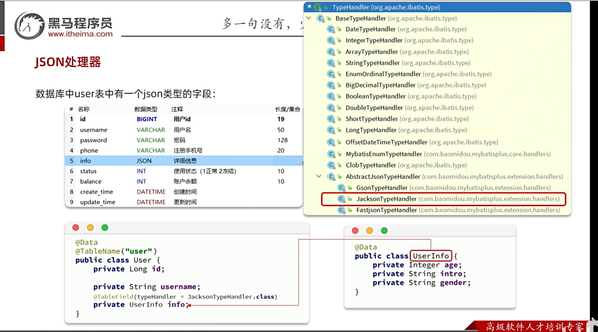

## 17.1步骤一：创建子对象UserInfo.java  
## 17.2步骤二：在User.java中添加UserInfo对象  ;  @TableField(typeHandler = JacksonTypeHandler.class)  

## 17.3步骤三开启映射：@TableName(value="user", autoResultMap = true)  

# 18.mybatisPlus提供的内置插件
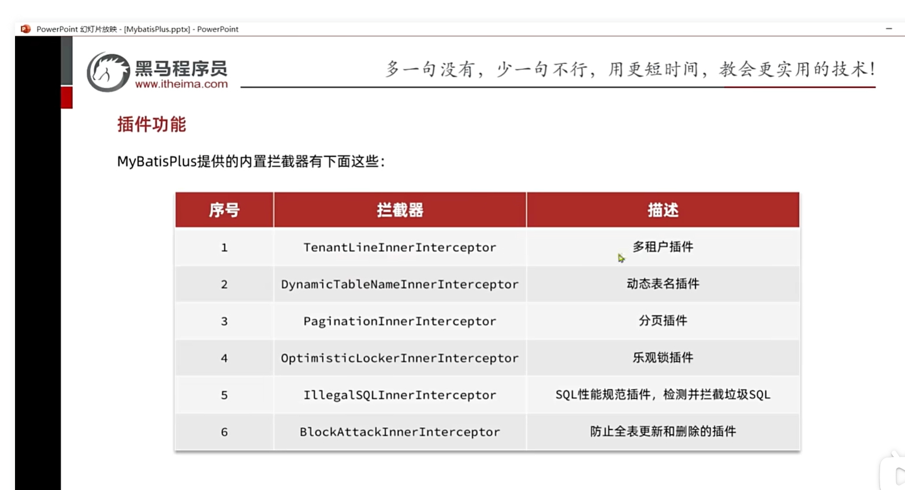

## 18.1 分页插件插件：
 ### 配置
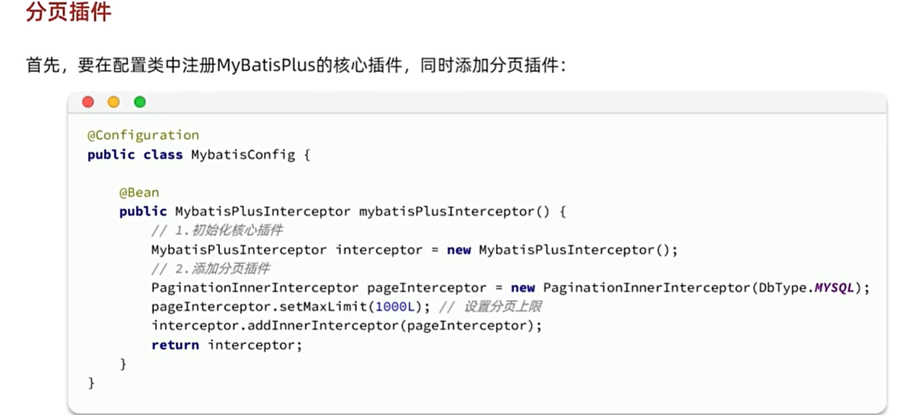

 ### 应用
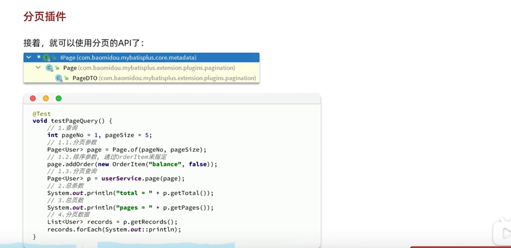

## 18.2接受参数包装
